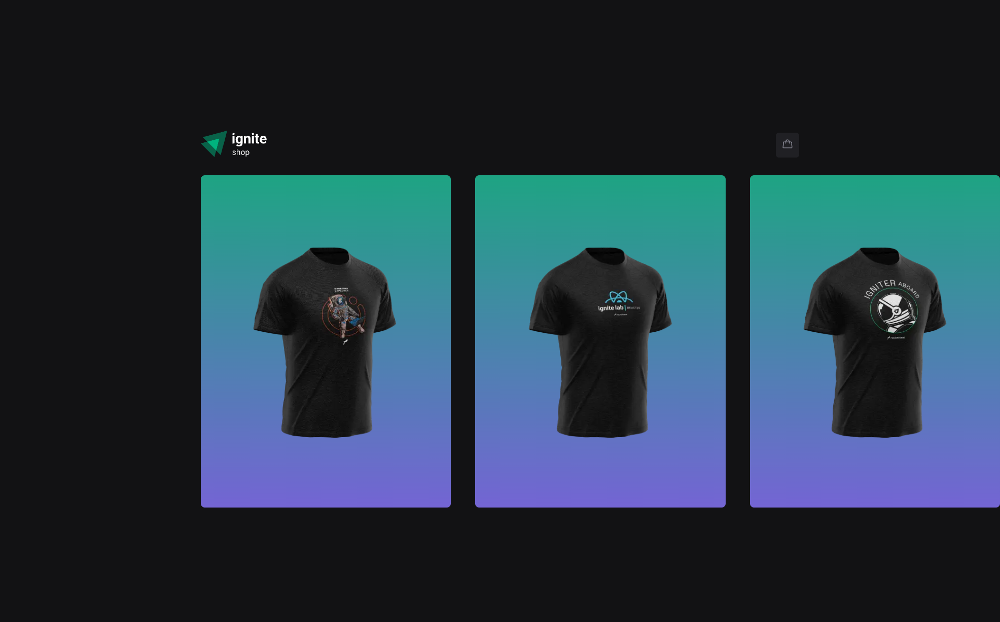
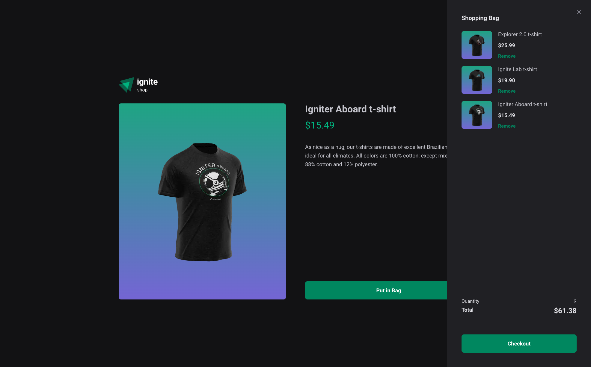
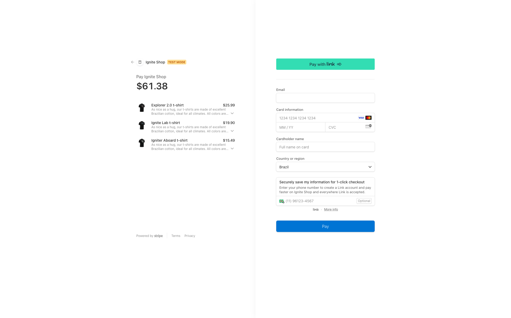
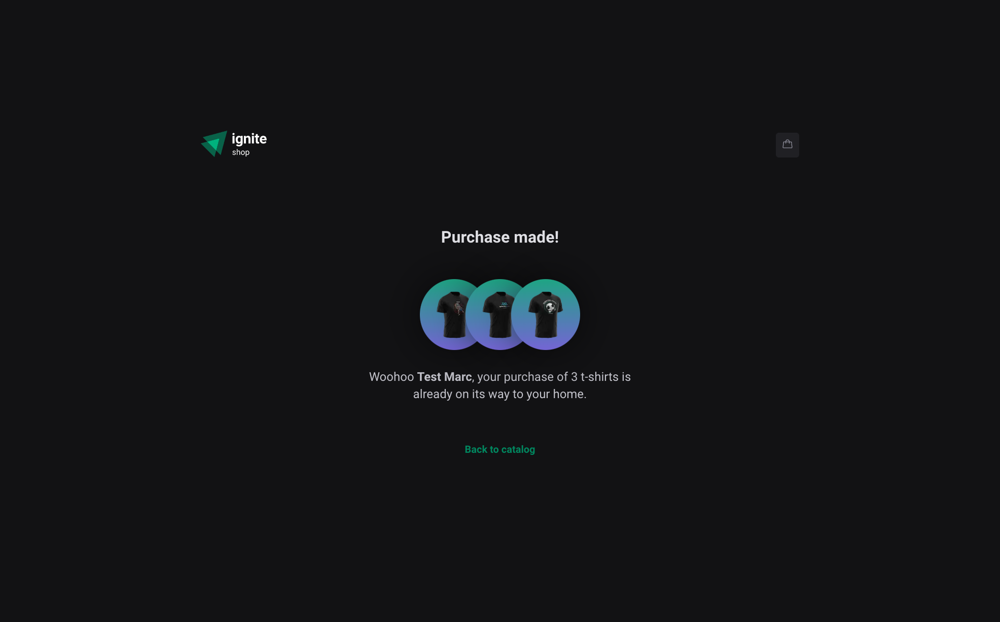

### Challenge 04 - Ignite Shop






#### 💻 Getting started

Clothing Shop application created with Next.js.

Follow the steps below:
```bash
# Project dependencies
$ npm i

# Make a copy of '.env.sample'
# Fill up with YOUR environment variables
$ cp .env.sample .env.local

# Start the app
$ npm run dev
```

The application will be initialized on the port: `3000`

#### 🔗 Challenge link
https://efficient-sloth-d85.notion.site/Desafio-04-Adicionando-features-ao-Ignite-Shop-91e5b2c26c9342f5b1375ba66907d0b7